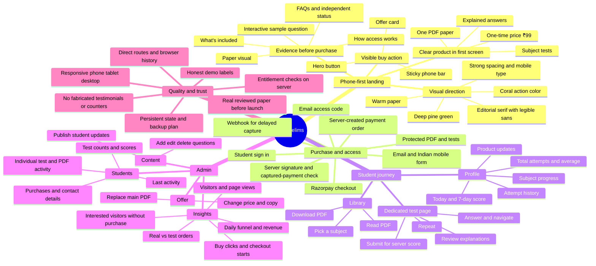
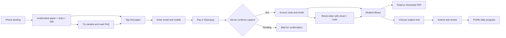

# CivilPrelims: full redesign map

## Audit: what changed

| Area | Previous problem | Current decision |
| --- | --- | --- |
| Positioning | Vague prediction claims and weak product clarity | Name the PDF, explanations and tests at the top; put ₹99 beside the primary action |
| Mobile hierarchy | Landing felt too simple but also required too much hunting | Distinct editorial hero, paper preview, benefit strip and persistent phone purchase bar |
| Visual system | Generic gradients, glass cards and unrelated accents | Pine, warm paper and coral; bold sans headings mixed with a restrained editorial serif |
| Trust | Invented social proof and urgency undermined confidence | Show a real interactive sample and explicitly state independent UPSC practice status |
| Checkout | Simulated payment risked appearing real | Local mode visibly says no charge; live mode requires server verification and a finished PDF |
| Account | No lasting buyer identity or return path | Purchase email + access code, protected library and dedicated profile |
| Tests | Short unsaved demo practice | Separate subject routes, server-graded submissions and saved daily history |
| Admin | Mock counters and disconnected editing | Persistent offer, PDF, question, update, student and traffic controls |
| Analytics | No way to inspect interest or drop-off | First-party visitor and buy-click events, checkouts, paid conversion and daily revenue |
| Routing | UI state could lose place on refresh | Shareable `/library`, `/profile`, `/test/:subjectId` and `/admin` routes |

## User flow

## Launch work that needs owner materials

1. Upload a reviewed, complete paper through Admin. The included PDF is a 3-question **local test document**.
2. Supply live Razorpay, Resend, admin password, public URL and session secret values from `.env.example`.
3. Host the Node server with persistent private storage and backups. A multi-server deployment needs shared storage before accepting buyers.
4. Publish accurate support/contact, privacy, refund and purchase terms that match the business. Avoid making claims about results or affiliation.
5. Test an actual small live payment, delayed payment webhook, email delivery, return login, PDF access and refund handling in the owner's gateway account before public launch.
